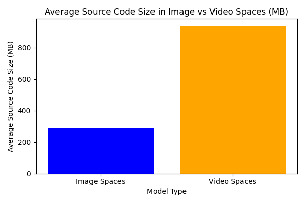

# Analysis of ML Applications: Image vs Video Processing Models

This project investigates whether image processing models are easier to adopt by software developers than video processing models, where "easier" refers to requiring less effort for coding and maintenance. The study focuses on ML applications hosted on Hugging Face Spaces.

---

## Table of Contents
1. [Objective](#objective)
2. [Data Collection](#data-collection)
3. [Data Analysis](#data-analysis)
4. [Results and Discussion](#results-and-discussion)
5. [Future Analysis](#future-extensions-and-analysis)
6. [How to Run](#how-to-run)
7. [Repository Structure](#repository-structure)

---

## Objective

This project aims to analyse and compare image and video processing models by evaluating the following:
1. Total number of ML apps (spaces) for the top 20 models of each category.
2. Average source code size of these spaces.

---

## Data Collection

### Step 1: Fetch Top 20 “Image” and “Video” Processing Models
**Script Used:** `getModels.js`

We use Hugging Face APIs to fetch the top 20 image models and top 20 video models. The models are filtered based on tasks:

- **Image Models**: Filtered by ‘image-classification’ and sorted by ‘downloads’.  
  **File name** – `image_models_<time-stamp>.csv`
 
- **Video Models**: Filtered by ‘video-classification’ and sorted by ‘downloads’.  
  **File name** – `video_models_<time-stamp>.csv`

#### Output File Format:
| model_name        | downloads | likes | tags                                     |
|-------------------|-----------|-------|------------------------------------------|
| microsoft/resnet-50 | 18618106 | 305   | transformers, pytorch, tf                |
| timm/resnet50.a1_in1k | 14662132 | 35    | timm, pytorch                           |

### Step 2: Fetch Spaces
**Script Used:** `getSpaces.js`

For each model obtained in Step 1, fetch all associated ML apps (spaces) using the Hugging Face API.

- **File names** – `image_spaces_<time-stamp>.csv`  
  `video_spaces_<time-stamp>.csv`

#### Output File Format:
| model_name        | spaces_count | spaces                                          |
|-------------------|--------------|-------------------------------------------------|
| microsoft/resnet-50 | 96           | Nuno-Tome/simple_image_classifier|hysts/space-that-creates-model-demo-space|
| timm/resnet50.a1_in1k | 13           | Nuno-Tome/simple_image_classifier|PeepDaSlan9/timm-resnet50.a1_in1k |

### Step 3: Fetch Source Code Sizes
**Script Used:** `getSourcecodeSizes.js`

For each space obtained in Step 2, fetch the total source code size (excluding image and video files).

- **File names** – `image_spaces_with_sizes_<time-stamp>.csv`  
  `video_spaces_with_sizes_<time-stamp>.csv`

#### Output File Format:
| model_name        | space_id       | source_code_size_kb |
|-------------------|----------------|---------------------|
| microsoft/resnet-50 | Omnibus/AI-or-Not | 10.03              |
| microsoft/resnet-50 | Khaled27/Naptah   | 427533.77          |

---

## Data Analysis

### Step 4: Total Spaces and Average Source Code Sizes
**Script Used:** `analyze_spaces.py`

This script performs the following analyses:
1. **Calculate Total Spaces**
   - Compute the total number of spaces for image and video models.
   - Store the results in Sheet 1 of an Excel file.
   
2. **Calculate Average Source Code Size**
   - Compute the average source code size for spaces associated with image and video models.
   - Store the results in Sheet 2 of the same Excel file.

3. **Generate Visualizations**
   - **Bar Graph:** Comparison of total spaces for image vs. video models.
     
   - **Bar Graph:** Comparison of average source code size for image vs. video models.
     

---

## Results and Discussion

The analysis confirms or refutes the claim that "it is easier to develop ML applications using image processing models than video processing models" based on the following observations:

### 1. Total Spaces Comparison
- The total number of spaces for the top 20 image models versus the top 20 video models reflects their adoption and ease of integration by developers.
- A significantly higher number of spaces associated with image models suggests that developers find them more approachable or better suited for practical applications. This could indicate easier integration, better documentation, or a broader range of use cases for image models compared to video models.
- Conversely, if video models have a similar or higher number of spaces, this would suggest a comparable level of adoption, implying that the added complexity of video processing might not be a significant deterrent.

### 2. Average Source Code Size
- The average source code size of spaces associated with image and video models serves as a proxy for measuring development effort.
- Smaller average source code size for image spaces suggests that these applications are generally less complex, easier to implement, and require less customization by developers. This could be due to the availability of pre-trained models, simpler preprocessing pipelines, or a more streamlined deployment process.
- On the other hand, larger source code sizes for video spaces may reflect the inherent complexity of working with video data, including challenges like temporal processing, larger datasets, or the need for more intricate architectures. If the code size for video spaces is significantly larger, it may indicate higher development and maintenance effort, thereby supporting the claim that image applications are easier to develop.

Note: While calculating the source code of spaces, any examples containing image and video files have been ignored as they may cause the source-code size to vary.

---

## Future Extensions and Analysis

While the current analysis provides insights into the adoption and complexity of image and video ML applications, there are several avenues for further investigation to strengthen the conclusions and explore additional factors influencing the adoption of these models.

### 1. Time-based Trends
- Analyse how the number of spaces for image and video models has changed over time.
- This can reveal whether video model adoption is accelerating due to advancements in hardware, improved model architectures, or an increasing number of use cases like video summarization and surveillance.
- Conversely, if image model adoption remains dominant, it could highlight the sustained simplicity and applicability of image-based ML solutions.

### 2. Developer Community Engagement
- Measure engagement metrics such as the number of forks, issues, or pull requests on spaces associated with image and video models.
- High engagement could indicate a strong community supporting the development and troubleshooting of certain types of spaces, influencing their ease of adoption.

### 3. Maintenance Effort
- Analyse the number of commits or updates for spaces over time.
- **Frequency of Updates**: Frequent updates to video-based spaces may indicate higher maintenance effort, possibly due to the complexity of integrating diverse datasets or refining computational workflows.
- **Nature of Updates**: Examining the purpose of updates—such as fixing bugs, improving features, or addressing performance issues—can shed light on the challenges developers face.
- **Developer Engagement**: Spaces with active maintenance may also reflect a more robust developer ecosystem, but higher maintenance requirements could deter adoption by smaller teams or individual developers.

---

# How to Run

## Prerequisites

1. Install the required Python libraries:
    ```bash
    pip install pandas matplotlib openpyxl requests
    ```

2. Install the required Node.js packages:
    ```bash
    npm install
    ```

## Steps

1. **Fetch top models**:
    Run the script to retrieve the top 20 image and video models:
    ```bash
    node src/getModels.js
    ```

2. **Fetch spaces for models**:
    Fetch the spaces associated with the models:
   
    Note : While calling main() method, make sure to pass the correct file name in the readCSV() method. i.e `image_models_<time-stamp>.csv` and `video_models_<time-stamp>.csv`
    ```bash
    node src/getSpaces.js
    ```

4. **Fetch source code sizes**:
    Retrieve the source code sizes for the spaces:
   
    Note : While calling main() method, make sure to pass the correct file name in the readCSV() method. i.e `image_spaces_<time-stamp>.csv` and `video_spaces_<time-stamp>.csv`
    ```bash
    node src/getSourcecodeSizes.js
    ```

6. **Analyse the data**:
    Perform the analysis and generate the results:
    ```bash
    python src/analyze_spaces.py
    ```


## **Repository Structure**

```
project_root/
├── src/
│   ├── analyze_spaces.py       # Python analysis script
│   ├── getModels.js            # Fetch top models
│   ├── getSpaces.js            # Fetch spaces for models
│   ├── getSourcecodeSizes.js   # Fetch source code sizes
│
├── data/                       # Input data files, the csv files generated by js and py scripts
├── results/                    # Output files
│   ├── model_analysis_results.xlsx
│   ├── total_spaces_image_vs_video.png
│   └── avg_source_size_image_vs_video.png
│
└── README.md                   # Project documentation
```
